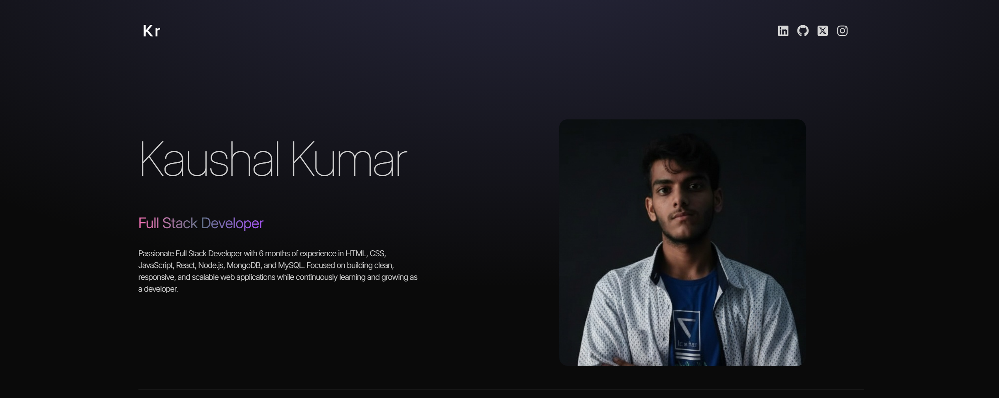
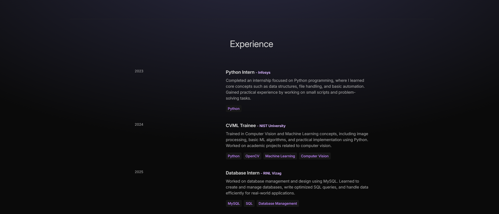
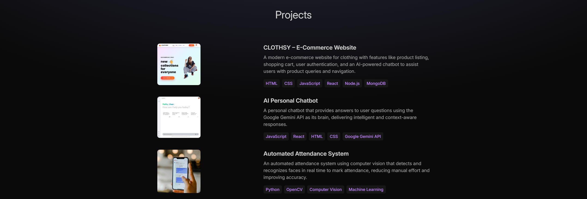

# 🌐 Portfolio Website

A modern, responsive personal portfolio website built with **React**, **Vite**, **Tailwind CSS**, and **Framer Motion**.  
This project showcases a full-stack developer's journey through animated sections including About, Experience, Projects, Technologies, and Contact.



---

## ✨ Features

- 🎨 **Modern UI/UX** – Clean, professional design with smooth animations
- 📱 **Fully Responsive** – Optimized for all device sizes
- ⚡ **Fast Performance** – Built with Vite for lightning-fast builds
- 🎭 **Smooth Animations** – Powered by Framer Motion
- 🧩 **Component-Based** – Easy to maintain and scale
- 🎯 **Easy Customization** – Update content through simple configuration files

---

## 🚀 Tech Stack

| Technology | Purpose |
|-----------|---------|
| **React** | Component-based UI development |
| **Vite** | Fast development server & build tool |
| **Tailwind CSS** | Utility-first CSS framework |
| **Framer Motion** | Animations and transitions |
| **JavaScript (ES6+)** | Modern JavaScript features |

---

## 📸 Preview

### Technologies Section

*Showcasing technical skills with interactive icons*

### Experience Timeline

*Professional journey with detailed internship experiences*

### Projects Showcase

*Featured projects with technology stacks*

### Contact Information

*Easy-to-reach contact details and social links*


---

## 📁 Project Structure
```
portfolio/
├── node_modules/
├── public/
├── screenshots/              # Project preview images
├── src/
│   ├── assets/              # Images, icons, SVGs
│   ├── components/          # Reusable UI components
│   │   ├── About.jsx
│   │   ├── Contact.jsx
│   │   ├── Experience.jsx
│   │   ├── Hero.jsx
│   │   ├── Navbar.jsx
│   │   ├── Projects.jsx
│   │   └── Technologies.jsx
│   ├── constants/           # Static content data
│   │   └── index.js
│   ├── App.css
│   ├── App.jsx
│   ├── index.css
│   └── main.jsx
├── .gitignore
├── eslint.config.js
├── index.html
├── package.json
├── postcss.config.js
├── tailwind.config.js
├── vite.config.js
└── README.md
```

---

## 🛠️ Installation & Setup

### Prerequisites
- Node.js (v14 or higher)
- npm or yarn

### Steps

1. **Clone the repository**
```bash
   git clone https://github.com/kaushalkr585-cmd/Portfolio-TAILWIND CSS-REACT-FRAMER-MOTION.git
```

2. **Navigate to the project**
```bash
   cd portfolio
```

3. **Install dependencies**
```bash
   npm install
```

4. **Start the development server**
```bash
   npm run dev
```

5. **Open in browser**
```
   http://localhost:5173
```

---

## 📦 Build & Deploy

### Build for Production
```bash
npm run build
```
The optimized build will be generated in the `dist/` folder.

### Preview Production Build
```bash
npm run preview
```

### Deploy
The project can be easily deployed to platforms like:
- **Vercel** (Recommended)
- **Netlify**
- **GitHub Pages**
- **Cloudflare Pages**

---

## 🎨 Customization Guide

### Update Personal Information
Edit `src/constants/index.js` to modify:
- Personal details
- Experience entries
- Project descriptions
- Technology stack
- Contact information

### Replace Assets
Place your images in `src/assets/` and update references in components

### Modify Styling
- Update `tailwind.config.js` for theme customization
- Adjust colors, fonts, and spacing
- Modify animations in component files using Framer Motion

### Example: Adding a New Project
```javascript
// src/constants/index.js
export const PROJECTS = [
  {
    title: "Your Project Name",
    image: projectImage,
    description: "Project description here",
    technologies: ["React", "Node.js", "MongoDB"],
  },
  // ... more projects
];
```

---

## 🔧 Available Scripts

| Command | Description |
|---------|-------------|
| `npm run dev` | Start development server |
| `npm run build` | Build for production |
| `npm run preview` | Preview production build |
| `npm run lint` | Run ESLint |

---

## 📝 Key Sections

### Hero Section
Introduces the developer with name, role, and professional summary

### Technologies
Displays technical skills with recognizable framework/language icons:
- React, Next.js, Node.js
- JavaScript, MongoDB
- After Effects, Premiere Pro
- Python

### Experience
Chronological timeline of professional experience:
- **2023**: Python Intern at Infosys
- **2024**: CVML Trainee at NIST University
- **2025**: Database Intern at RINL Vizag

### Projects
Featured projects with descriptions and tech stacks:
- **CLOTHSY** – E-Commerce Website
- **AI Personal Chatbot** – Google Gemini API integration
- **Automated Attendance System** – Computer Vision application

### Contact
Easy-to-reach contact information including:
- Location: NIST University, Berhampur, Odisha, India
- Phone: +91 8697085904
- Email: xyz.430@gmail.com
- Social media links

---

## 🙏 Acknowledgements

- [React](https://reactjs.org/) – UI Library
- [Vite](https://vitejs.dev/) – Build Tool
- [Tailwind CSS](https://tailwindcss.com/) – Styling
- [Framer Motion](https://www.framer.com/motion/) – Animations
- [Lucide React](https://lucide.dev/) – Icons

---

## 📄 License

This project is open-source and available for personal use and learning purposes.

---

## 👤 Author

**Kaushal Kumar**  
Full Stack Developer

- 💼 LinkedIn: https://www.linkedin.com/in/kaushal-kumar-1a0370377/
- 🐙 GitHub: [\[Your GitHub\]](https://github.com/kaushalkr585-cmd)
- 📧 Email: kaushalkr.585@gmail.com

---

## 🤝 Contributing

Contributions, issues, and feature requests are welcome!  
Feel free to check the [issues page](https://github.com/kaushalkr585-cmd/portfolio/issues).

---

## ⭐ Show Your Support


---

<div align="center">
  <p>Built with using React & Tailwind CSS</p>
  <p>© 2026 Kaushal Kumar. All rights reserved.</p>
</div>